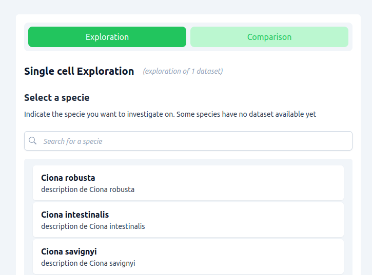
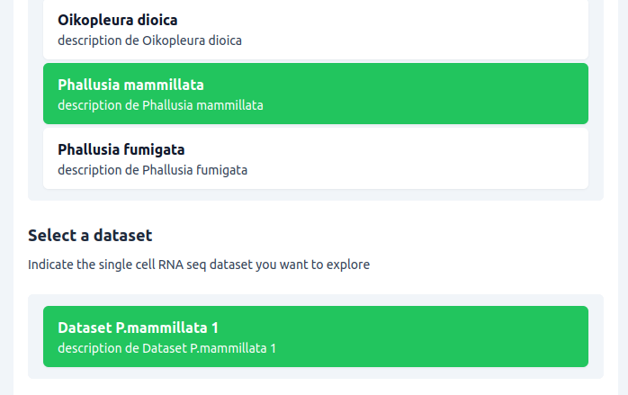
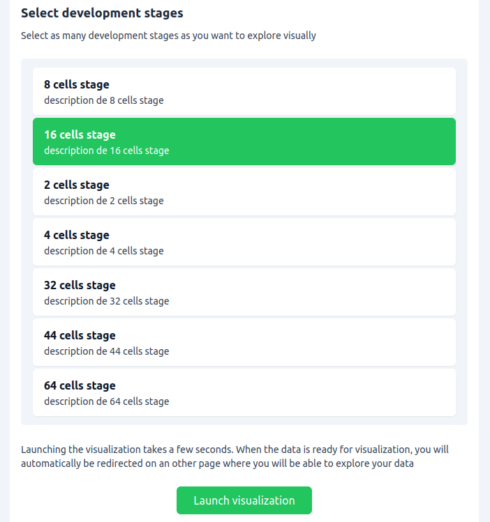
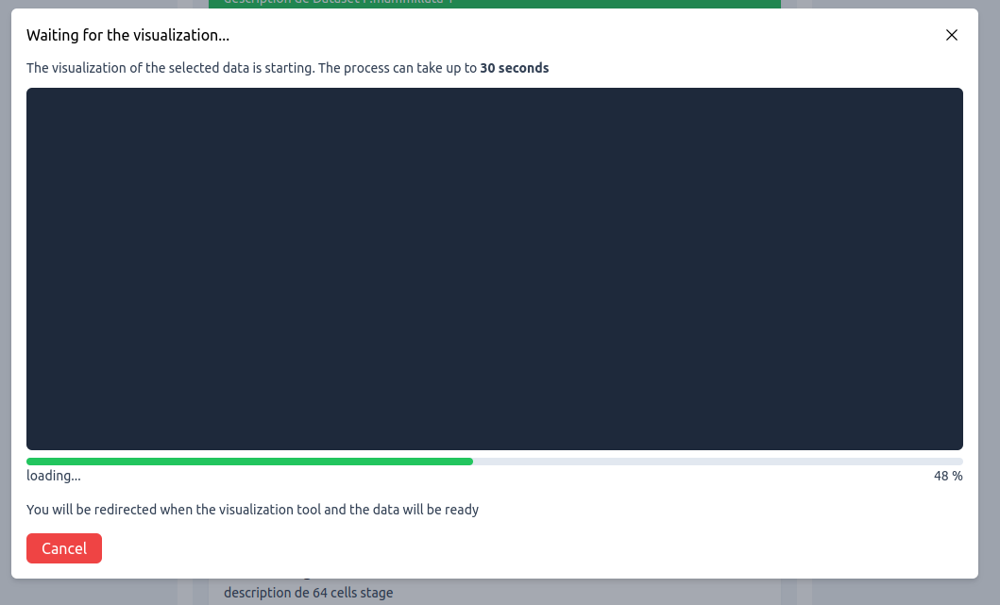
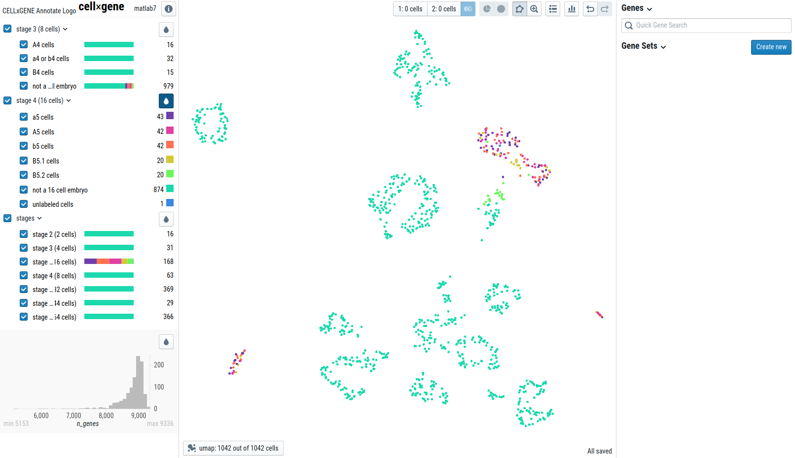
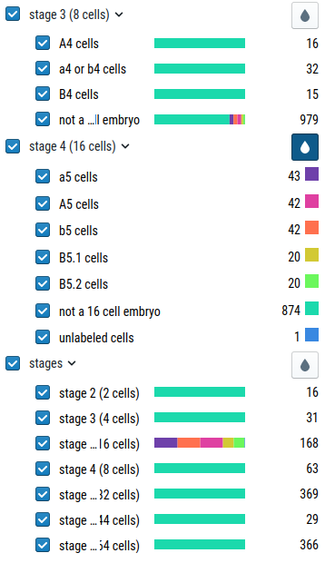
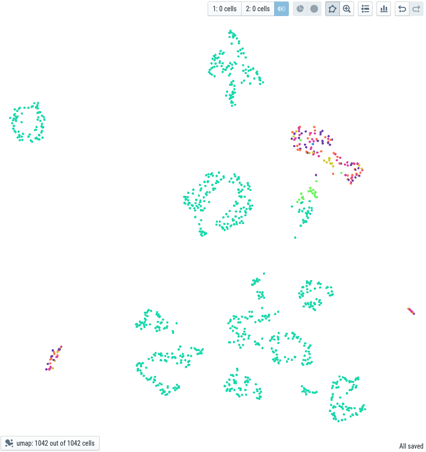
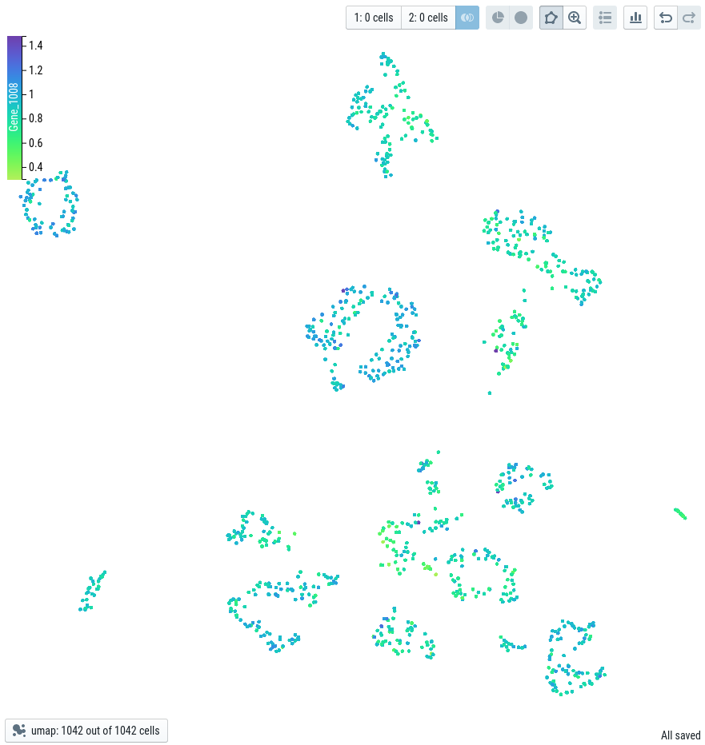
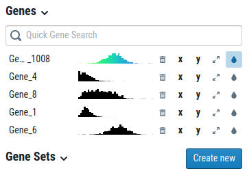
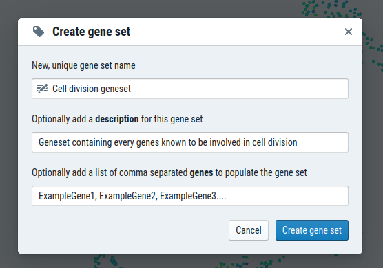

# RNAniseed Application : The single cell RNA seq visual tool

The RNAniseed Application is a tool allowing the ascidian community to explore large single cell 
RNA seq datasets visually. RNAniseed uses the Aniseed database making the exploration easier and 
more accurate.

The project is to ensure an easy way to explore single cell data as well as proposing a tool 
to centralize the datasets in order to improve the comparison potential of such data.

# How to use RNAniseed ?

RNAniseed is currently in developement. But the tool will soon be disponible on Aniseed website *(https://aniseed.fr)*
Anyone should have access to the visual tool as well as the public datasets uploaded by the community.

Using RNAniseed is easy:

1. Go on RNAniseed *(https://aniseed.fr/rnaniseed)*
2. Select the mode you want to use (**exploration** for 1 dataset, **comparison** for multiple datasets)
3. Indicate the **species**, the **datasets** and the **development cell stage** you want to investigate on
4. Hit the "Launch visualization" button
5. Explore the data as you want by using the **filters** disponible and the by looking for the expression of a **gene** or **geneset**

## Using the virtual tool 

The virtual tool of RNAniseed rely on cellxgene: an easy to use interface for single cell RNA seq exploration. This interface allow you to perform custom queries using the filters disponible on the 
left side bar.

Usually the main issue of single cell data is the lack of information needed to perform these kind of 
queries like the cell type, the development stage, metadata about genes etc...

To counter this problem, RNAniseed uses relevant data from Aniseed. This way, many more filters are disponible to perform a queries in the visual interface. 

## Possible queries using RNAniseed 

Earing about queries might scare you a bit as it often heavily related to informatics but performing a query doesn't need to be tedious. 

For instance, combining filters by clicking on the buttons of the left side bar of the visual interface is a way to query your data so easily. You might not even realized that you performed any kind of complicated query by doing so.

A query is performed when you select a filter, every cell in matching the selected filter will be highlighted in the visual interface. Colors may also help you to differenciate the different filters for each category.

## Concrete scenario

Let's say you want to investigate only on **A5 cells** disponible in a **specific dataset**. 

### Using the RNAniseed exploration mode

Even before your exploration you need to launch the virtual tool by filling the info about the dataset you want to use, the specie and the development stage. This phase before the visualization is important to help filter the data that might be valuable for your exploration and will prevent you to be lost in all the data available in Aniseed.

    

As you are currently working on **Phallusia mammillata**, you select this specie the first associate dataset present in the list.

    

Depending on the dataset you selected, different development stages will be displayed. Select those you are interested in. As you want to investigate on **A5 cells**, You want to select the 16 cell stage in priority with any other stage that might be relevant to you as well. 

    

After filling all the fields, just hit the **"Launch visualization"** button. The visualization takes some time to be launched but don't worry it takes at most 30 seconds. 

    

When you click on this button, the **RNAnissed** program filters only the relevant data from its database then this data is completed using the **Aniseed** database, catching relevant informations such as genes names, functions etc... 

In a final step, a file is created containing all this information and displayed using the visualization tool. Everything is done automatically, don't worry about it.

### Using the virtual tool 

    

When the visualization tool is launched you should end up in a screen looking like this. If you know cellxgene a bit you might have notice some similarities. In fact, the visual tool used for RNAniseed is based on a modified version of cellxgene where some RNAniseed specific features have been added.

#### Parts of the visual tool 

The visual tool is composed of 3 parts:

1. The **Filter side bar** *(at the left of the page)*: Containing clickable labeled box allowing you to filter the data in a specific way, inducing a coloration or making some cell disapear from the canvas. The Gene expression for each filters display itself when a gene is seleced. We will see how to use filters and combining them in a later part

    
    

2. The **Canvas** *(at the center of the page)*: Contains a point for every cell matching at least one of the element you used as a filter. The colors of the point can vary depending on the cell group the cell is part of. When a Gene is selected, the expression level can be directly seen by a color gradient on the cell points themselves.

    
    

3. The **Gene side bar** *(at the right of the page)*: Contains a small Gene search bar you can use to look for a specific gene within the dataset. When a gene has been found, clicking on it will reveal the expression level of every cell matching the filtration.

    
    

### How to filter data using the virual tool ?

Filtering the data using the virtual tool can be done by clicking on the buttons of the left side bar. When you select a filter, the colors of the cells present on the canvas change to match the filter the cell is a part of. 

To continue the example of the exploration for the **A5 cells**, it's possible to unselect all the filters and only keep the one called "A5 cells" to see where the cells are located on the canvas.

We can see **42 cells** of the type A5 present in **3 different clusters**. This means that the transcriptome of these **A5 cells** are very different in nature which underline the different fates of the **A5 cells**. 

Using **Gene 6** as a filter also show different transciption level within the same cluster. This differences could be significative if the same oberservation can be donne on different datasets. The **Gene 6** may have an important role in early cell differenciation or may be a marker for a specific cellular fate or position within the embryo.

The exploration possibilities are endless, you can perform much more complicated queries by combining multiple **filters**, **gene-expressions**, or even **genesets** !

## Licence

RNAniseed is under MIT licence, check the details in the LICENCE.md file