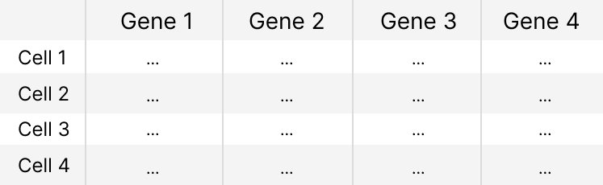
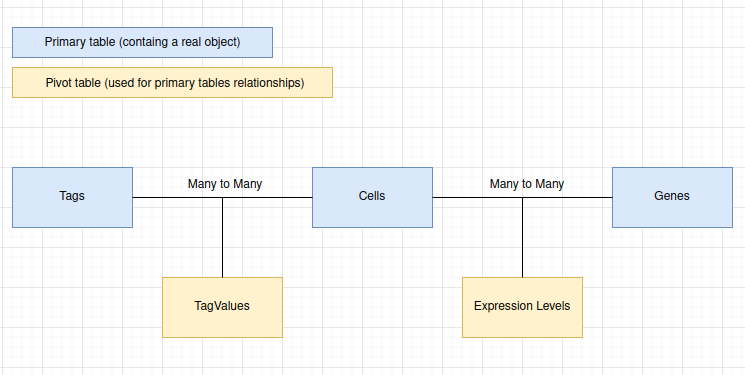
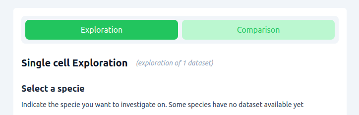
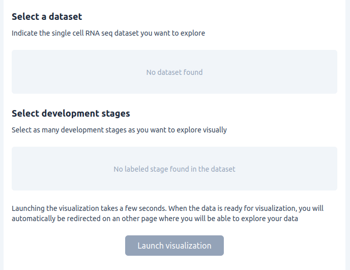
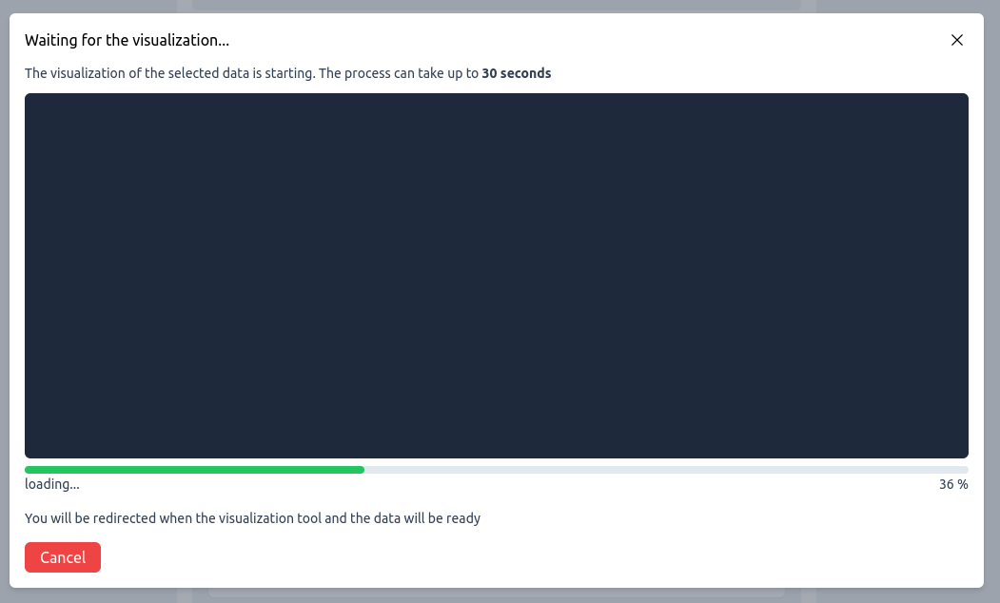

# RNAniseed Specification Book

The RNAniseed specification book ("cahier des charge" in french) is a document listing the goals of the project, the public for whom the tool is designed for and the technical specifications that are involved in the conception of the project.

## Small Glossary

- **Ascidian** : Ascidian : Animals belonging to the tunicate group. Their close proximity from vertebrates make them very useful for research especially for the study of early development. 
- **scRNAseq** : means single cell RNA sequencing, this is a reference to a biological method of data extraction by sequencing the cell's transcriptome a cell at a time. This biological technique is often couple with a statistical analysis to ensure that the data is reliable and can be used to draw correlations between a gene and a certain cell condition
- **Aniseed** : The ascidian community reference database where data about ascidian embryos are stored and can be queried from (https://aniseed.fr)
- **Filter** : This term is used a lot in this document, it's used to describe a condition that can be chosen by the user in order to affect the data selected by restricting the number of records matching the filtering condition. In other words, filter is the user friendly tool used to perform a query on the single cell RNA seq data
- **Tag** : A tag is the unique name given to a filter. This term is used to differentiate the act of filtering (querying) the data and the role of this filtration on the single cell RNA seq data
- **Query Interface** : This is a term used to describe the part of the project on which the user has to indicate the mode used as well as some details before the visualization of the data. The Query Interface is a reference to its UI as well as its role : performing a first data filtration depending on the user's scientific question.
- **Visualization Interface** : This term describes the part of the application that actually performs a visualization of the data. The Visualization Interface is a reference to its UI, its role in the visualization process and the filtration mechanisms that can be performed using the UI of this interface.
- **Query Filter** : It's a filter used in the Query Interface. The tags of these **Query Filters** are: **Species**, **Dataset**, **Development Stage**. They have to be filled with a value to launch the visualization part of the Application
- **Exploration Filters** :  It's an optional filter that can be used or not during the visualization through the **Visualization Interface**. As those filters can be selected when the user wants, they grant a large diversity of combination to choose from, which is an ideal way to explore the single cell RNA seq data

## The public

The public of the project is the ascidian community and the scientific community at large with none or little background in informatics but who still want to explore and visualize large single cell RNAseq datasets.

First the project will focus on the ascidian community and will be tight to the Aniseed database as a data provider of single cell RNA seq data. The proximity with the Aniseed database will allow the deployment of a visualization tool that can be used easily by the ascidian community.

Later when the project will be mature enough and the visualization tool will be reworked in order to be reused by the scientific community more broadly by providing a simple integration with external databases.

## The Goals 

Usually, visualization of single cell RNA seq data requires using R or python, which many biologists are not familiar with. We believe that this is a pain point that prevents the mass adoption of single cell data exploration within the ascidian community, despite all the potential in the study of tunicates.

The main goal of this project is to eliminate this pain point by providing an easy to use visualization tool for biologists having no or little background in informatics.

In general, statistics and clusterization are performed on such large datasets. This is also the case for this tool, which makes the biologist able to identify clusters in their single cell RNA seq data and allow them to filter this data using a rich variety of parameters to choose from.

The clusterization and the filters gives the RNAniseed tool two purposes:

1. **Exploration of a dataset:** The user should be able to find a dataset to explore using the virtual tool and navigate in the data easily using the filters disponible to guid the data exploration
 

2. **Comparison of datasets:**  The biologist should be able to compare visually two datasets using the clusterization as a visual indicator as well as the the level of gene expression and leveraging the filtration of certain parameters for more accurate dataset comparisons

The main focus of the tool is to be easy to use. Developing a well designed user interface and a solid link with all the databases serving as data providers will be mandatory for the success of the project.

## Project pieces 

RNAniseed serves as an interface for the user between a database and a visual tool while giving some context as well as filters to use during the visualization process. The project is composed of 3 distinct parts:

1. **A database** : the database has a collection of single cell data formatted using a predefined schema or composed of documents to read. The database also include some metadata (also called tags) that are used to query a part of the available data or to realize filtrations during the visualization process in order for the user to explore the data more efficiently and to observe patterns within the single cell RNA seq data

2. **A query interface** : the query interface allows the user to choose the mode of experiment the user wants to perform as well as selecting the data he wants to use for his experiment. The UI should be simple and encourage the biologist to select some criterias before launching a visualization blindly with no clear goal in mind.

3. **A visualization interface** : he visualization interface is a way for the user to have a clear picture of the data selected and to explore, find patterns or compare datasets using the filters on the data displayed.

These 3 pieces of the project are detailed in specific sections of this specification book but the entire project relies on data filtration and data tagging to make sense, this is the topic discussed in the next section.

## Data filtration

The main exploration and comparison features of the project rely on the flexibility for the users to leverage filters upon the data. Filters rely on tags surrounding the sequencing data, so the metadata collected with the single cell RNA seq data should be used to make useful tags.

### Choosing the right filters

To ensure the usability of the project for a biologist, precise data filters should be leveraged. A filter is a data characteristic the user can use to exclude a part of the data from an exploration or a comparison process.

Picking the right types of filters for the project is crucial for the usability and the stability of the project. As such, the implemented filters should fill in multiple characteristics :

1. A filter should be self explanatory, easy to understand for a biologist. Excluding any statistical metrics to become a filter (At least for now. When the community will have a better understanding of the underlying techniques used for visualization, statistical filters might be implemented if the community needs these)

2. A filter should make sense biologically and should be compatible

3. A filter should rely on pre-annotated boolean tags. It would make sense that a tag could have a numerical value to be enter by the user and a threshold validation of the tag will be computed but this method should be avoided in order the project more usable of biologists

### Relevant tags and filters

Some relevant tags found for single cell RNA seq data are :

1. The Specie
2. The Dataset
3. The Cell Stage
4. The Cell Fate
5. The Cell Name within embryo
6. The Gene Expressed
7. The intensity of the Gene Expression

Filtering using these tags will help the community tremendously especially if the filters can be combined in a query or for data exploration purposes.

### Exploration Filters vs Query Filters

To explore available single cell data visually, using the entire database would be way too hard to start with. In order to counter this issue, some of the tags can be used as a primary filter to eliminate unwanted data even before the visualization process.

The **Specie**, **Dataset** and **Development Stage** tags are especially interesting for this primary database query because it massively reduce the amount of data that the biologist have to work with and also force the end user to choose a preset of filters to guide his exploration right out the bat which require him to think a little bit about the exploration goals before launching the visualization process.

Thus, the **Specie**, **Dataset** and **Development Stage** are called **Query filters**  because of their use during the data selection phase before the visualization of the data occurs. These filters are required to select a part of the data contained in the database. They also are required to launch a visualization process

The remaining filters will be used as **Exploration Filters** (aka filters that can be optionally used during the visualization of the data)

### Concrete Exploration Queries

The RNAniseed project should support some concrete exploration queries that could be used for exploration of the single cell RNA seq data. The Filters previously introduced will help the biologist to explore the dataset using the following concrete exploration queries

- Filtration using a **gene expression**
- Filtration using a **geneset**
- Filtration by **development stages**
- Filtration by **gene types** (or **gene functions**)
- Filtration by **cell fate**

Other concrete exploration queries might be added later depending on the diversity of labels (**Tags**) the single cell RNA seq datasets contain.

All of these concrete exploration queries serve as data filters, they could be selected at any time and combined to perform more complex filters.

## Database Part

RNAniseed needs to have a proper database to handle the single cell RNA seq data and storing all the tags that will be required for a smooth data exploration.

### Data structure 

The structure of the database is guided by two main purposes : **storing single cell RNA seq** data (especially the gene expression of every genes for all the cells) and **storing related tags** serving as filters for other parts of the project.

### Type of database

Usually single cell RNA seq data is stored in table files using the csv, h5 or h5ad file formats. Such data formats require building a protocol able to convert them into rows that can be placed into a relational database.

A table of gene expressions for every cell should be converted into SQL statements that would create rows according to the original gene expression using the database schema defined in the next section

    

Single cell RNA seq genes expression levels can be stored in an SQL database using a Cell and a Gene table. This kind of database also allows linking any cell stored to an unlimited amount of tags from a Tag table.

SQL makes it easy to filter cells according to specific tags. This enables a high precision when it comes to selecting only a handful of cells. Moreover, relational databases are also highly scalable which is very relevant in the case of single cell RNA seq data to the large number of cells, gene expressions and tags that need to be stored.

### Database schema

The database schema is one of the most important parts of the project. It will impact the queries complexity as well the database response time. In order to minimize the response time, adopting a flexible database schema is crucial.

Biologists are very busy people. They have no time to spare trying a fancy scRNAseq visualizer. The RNAniseed database should have a very good response for any query : **100ms maximum**

    

This simple database schema allows to add as many single cell RNA data as possible and any number of tags. This would make querying the single cell RNA seq data easily and the tag filtration would be efficient too.

The tags might contain informations surrounding the cells like the **cell type**, the **cell fate**,
the **origin dataset** ect...

Using a Tags table allows a certain flexibility allowing to add new tags types and bind cells to a new tag easily. This structure also prevents holes in the tables. For instance, for a cell, not having a certain Tag is ok because all the tags types are not hard coded as table columns.

## Query Interface

The query interface is the tool that represents the first interaction of a user with the database. In fact, the main purpose of the query interface is to allow the user to select a piece of the data that wanted for a study.

The query interface is composed of three parts: the **UI**, a **small data selector interface** and a **visualization launcher** containing the logic to gather the desired single cell data and build a file readable by the visualizer containing all the tags that might be used during the biologist experiment (exploration or comparison)

### UI prototypes

The UI should be accessible and easy to understand for biologists. One of the main challenges is to make obvious the type of experiment that can be done using the visualizer. 

The biologists have to choose between doing an **exploration experiment** or a **comparison experiment**. Afterwards, the user has to select a pool of single cell RNA seq data to use for the experiment.

    

The UI has to be easy to use, clicking on a specie allows to select only a related dataset and when the dataset is selected the cell stage can be selected. The validation only works when those fields are filled in. This prevents the visualization launcher from triggering if incomplete or contradictory selections are typed in by the user.

    

The Visual Launcher takes some time to build and gather the necessary data for visualization. As the Visual Launcher execution time is unlikely to be less than a few seconds, a waiting animation should be added in order to make obvious to the user that a process is currently running and that the visualization will be disponible soon.

    

### Small data selector

Interacting with the UI, the small data selector allows the user to perform small queries to the database in order to check which datasets are available for the selected species or which cell stages can be selected.

This checking mechanism linked to the UI directly gives an overview of the available data while preventing the user from asking for non-existent data from the database.

Overall the small data selector makes the project more transparent and guid the user all along the data selection process.

### Visualization Launcher 

The Visualization Launcher is the program that converts the data selected by the user into a format readable by the Visualization Interface while injecting useful tags into the mix to make the navigation in the Visualization interface easier.

This launcher relies on the quality and the number of tags to give an interesting experiment. Measuring the number of the tags involved during data selection would be useful for a user to estimate the quality of the final visualization

## Visualization Interface

The Visualization Interface allows exploring the single cell RNA seq data. The tags should also be available to filter the data easily by any user.

A CellxGene like interface would fit perfectly for the Visualization Interface, because it matches our main criterias for the visualization.

1. Allowing to do mini queries using some extracted from the database
2. Filtering by gene and possibitity to create gene sets 
3. Having a clusterization method 

